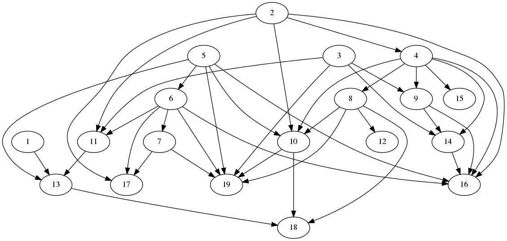

# computation-dag-async

Creating and asynchronously processing a directed acyclic computation graph.

Tools for creating and executing computational Directed Acyclic Graphs.  Currently this
only operates on types that implement the `Operable` trait, which mainly requires
the `Product` and `Sum` traits to operate over iterators.  The provided examples
all use simple arithmetic types, but this could be extended to tensorial types.

## Problem Overview

This application is meant to:

1. Generate random computational DAGs
2. Execute DAGs in parallel on a multi-threaded CPU
3. Print the order in which the nodes were executed, specifying which nodes 
   were executed in parallel.

Part 1 can be considered a separate problem, of creating a "valid" DAG, where
the graph must be connected and acyclic.

Parts 2 and 3 are achieved together with the DAG executor.

## Prerequisites

This program was written using Rust 1.44.1, the latest stable.  Please follow 
the instructions at
[Install Rust](https://www.rust-lang.org/tools/install) for ways to install on
your system.

Additionally, the `dot` program from GraphViz is required for pretty-printing,
which can be found at [GraphViz](http://www.graphviz.org/download/).

As an optional requirement, `pandoc` is used for generating the pdf version of 
this document.

## General repo overview

Everything is organized as a standard Rust repo:
* `/src` for the code
* `main.rs` for the entrypoint
* `lib.rs` for module declarations.

Overview of files:
* `operation.rs`: defines simple operations over arithmetic types, to be used
  inside the DAG executor
* `dag.rs`: defines DAG and required operations
* `random.rs`: specifies how to generate a random `Operation` and `Dag`, along
  with a custom distribution for the `Dag`, which can be customized at the
  command-line
* `computation.rs`: multi-threaded execution model given a `Dag`

Additionally, a `Makefile` is provided to avoid remembering commands.  Try running
`make help` to see all of the possibilities.

## Part 1: Generating random directed acyclic graph

There is no particular standard for how to represent a DAG in code, but there 
do exist formats for graphically representing them.  For pretty-printing, this
program outputs DAGs in the DOT format using the `print` command.

For example, to generate a png version of a random graph:
```bash
cargo run print | dot -Tpng -o out.png
```

To stay with the dot format, you can run:
```bash
cargo run print | dot
```

The Makefil variants are:
```bash
make print_png
make print_dot
make print
```

An example graph is provided at `example.png`.



NOTE: `dot` takes a long time for anything over 50 nodes, so be sure to stay
underneath that threshold.

For simplicity in random DAG generation by using `rand::random()`, the `Dag` 
type implements the `Distribution` trait on `Standard`, which uses `const`
variables for the node bounds.  These variables, named
`MIN_NODES`, `MAX_NODES`, and `EDGE_PERCENTAGE`, can be modified by hand in 
`random.rs`.

Additionally, a custom distribution is provided, `DagDistribution`,
for deeper customization of the random graph.  By providing 
command-line arguments, you can customize the minimum nodes, maximum nodes, and
percentage of an edge between two nodes.  Try `make cargo_help` for all 
running options.

Since there isn't a particular set of topological rules that the computation 
DAG needs to follow, we will consider all DAGs to be valid, even unconnected
graphs.  In a perfect solution, we would do more graph analysis and
separate unconnected graphs for separate processing.

DAGs can be represented with adjacency matrices, but it was easiest to directly
generate the DAG in code, rather than creating some an alternative representation.

## Part 2: Multi-threaded DAG execution

In our simple representation, the `operation` performed at a node is defined
as a simple function that takes inputs of one type, and outputs one result of
that type, which in simplified form would be:

```rust
pub type Operation = dyn Fn(&Vec<T>) -> T
```

In a real computation environment, such as in a neural network, operations 
would likely be performed on tensors or matrices whose dimensions are not always
the same.  For example, one layer in a neural network may perform operations on
a 40 x 20 matrix, while the next layer requires a 10 x 100 matrix.  The `Operable`
type would need to be extended for tensorial types.

### Multi-threading considerations

In order to perform all computations in a multi-threaded environment, the first
and simplest possibility is to use the raw `thread::spawn` on every single
computation.  This approach, unfortunately, can quickly overrun a system when
processing a large computation graph with thousands of nodes.

The next option is to use a threadpool in order to avoid over-using system 
resources, but this creates a scheduling problem.  It's unwise to schedule everything
from the start and allow everything to resolve.  For example, 
if all threadpool resources are used and waiting for an 
answer from an unscheduled computation, the program will lock.
Good topology analysis is required to
address this limitation. For example, a simple solution would be to perform all computations
at a certain "rank" all at once.  In the earlier provided example, that would 
be first executing nodes `1`, `2`, `3`, and `5`, since they are all parent
nodes.  This optimization may not maximize system 
resources, however.  Certain computations may finish much faster, but the entire
network needs to wait for the full rank to finish before moving on to the next one.

### Asynchronous operation

The best option is an asynchronous solution, allowing the computation of each
node to be handled concurrently by some runtime. The `tokio` runtime is the current standout
option in the Rust ecosystem, but other options exist, such as `async-std`.  By
using asynchronous tasks with a threadpool under the hood, you can schedule
many more operations than would be possible with a standard threadpool.  You can
even schedule everything right from the start and allow the runtime to execute
the entire DAG, which addresses our previous problems.  For example, if 1000
tasks are all waiting for one computation, the tasks can stay `await`ed without
taking up (too many) system resources.

To begin with, I attempted to do this simply with `async` and `await`, which
would have worked, except that we sometimes need to "split" the result of an
computation.  For example, if a node has more than one child, then
each child needs to `await` some `Future`, but the same `Future` can't be awaited
more than once.

The solution is to use `channel`s: each node `await`s the 
receiver end of its parents' `oneshot` channels, runs its computation, and then
sends the result to all of its children.  Again, everything can
be scheduled from the start, without hogging system resources.  Once all tasks
are setup, you simply need to join them and allow for the runtime to resolve
everything.

To create and execute a random DAG, run:
```bash
make execute
```

This will print out the DAG and when a node is processed, including which thread
eventually executed the node.

To process a huge graph, run:
```bash
make execute_huge
```

This uses the `Default` function everywhere to avoid overflows.

Also, the number of threads in the `tokio` runtime can
be modified through the number of `core_threads` at `#[tokio::main(core_threads = 8)]`
in `main.rs`.

## Part 3: Order of execution

Since the approach is totally asynchronous, it's impossible to show
the order of processing of the nodes without doing additional topological
analysis.  As an alternative, a `Delay` operation is provided, which simply
stalls for 2 seconds before returning `Default::default()`, so the result will
always be one more `0`s.

By using delay operations though, you can see how each rank is optimally executed
without requiring additional analysis of the DAG.  You can run the DAG with 
`Delay` operations with:

```bash
make execute_delay
```

The graph is intentionally made small for this command, to easily
trace which operations are happening at the same time.

Sample output:
```
digraph {
  1 -> 6;
  3 -> 4;
  5;
  6;
  2 -> 3;
  2 -> 5;
  4;
}
--- snip ---
Starting everything!
ThreadId(7): processing node 2
ThreadId(8): processing node 1
--- 2 second delay ---
ThreadId(8): processing node 5
ThreadId(6): processing node 6
ThreadId(4): processing node 3
--- 2 second delay ---
ThreadId(4): processing node 4
--- 2 second delay ---
Collecting results
Results: [0, 0, 0]
```

In this example, we have three processing steps:
1. Nodes 1 and 2 have no parents, so they are processed at the same time
2. Nodes 3, 5, and 6 are processed because 3 and 5 depend on 2, and 6 depends on 1
3. Node 4 is processed because it depends on 3

Looking at the printed `digraph` earlier, this corresponds perfectly to our
expectations.

## Testing

Unit tests are provided in each module, which can be run using:

```bash
make test
```

Note that this may take up to 30 seconds as some tests involve 100,000 nodes.

## Conclusion and further steps

I tried maxing this out with huge numbers of nodes.  Unfortunately, at around
300,000 nodes, there is a big performance slowdown at the `join_all` portion of
the tasks.  I need to do more research and see limits for tasks,
or any limitations on the `join` operation.  Otherwise the performance is pretty
good!

Feel free to reach out about any questions.
